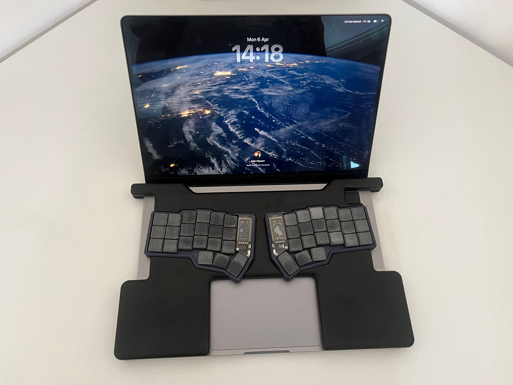
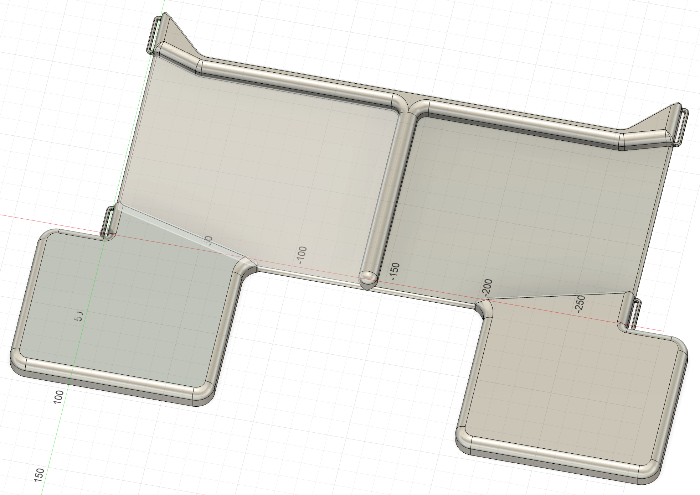

# ergo-keyboard-on-laptop

Printable plates that hold a split ergonomic keyboard on top of a laptop, so you never have to fall back to the built-in keyboard.



## Why

This setup is especially useful when:

- working in transit (train, plane)
- attending onsite meetings
- browsing from the sofa, a hammock, or anywhere else away from a desk

## Finding the right plate

Plates are organised by laptop model and then by keyboard model, under `files/<laptop>/<keyboard>/`. Available plates today:

```
files/
├── any_laptop/
│   └── any_keyboard/
└── macbook_pro_14/
    ├── any_keyboard/
    └── typeractive_corne/
```

Browse the hierarchy, pick the folder that matches your hardware, and read the local `README.md` for details and caveats specific to that plate.

## Printing

Each folder contains the plate in several formats:

- `plate.step` — recommended format for CNC machining services.
- `plate.stl` — for 3D printing (not recommended, see below).
- `plate.f3d` — Fusion 360 source file. Open this to edit or remix the design.

Upload any of them to an online manufacturing service and follow their ordering form.

**Recommendation: CNC-machined aluminium, not 3D printing.** The plate has wide 2 mm-thick sections that would be fragile when printed in plastic.

Personally, I used [jlccnc.com](https://jlccnc.com) for mine; expect a cost of around €150 per plate.

**Tip:** you can visualise any plate online by clicking its `.step` file on GitHub.

## Gallery

Renders of each plate available in this repository:

| Plate | Render |
| --- | --- |
| [MacBook Pro 14" — Typeractive Corne](files/macbook_pro_14/typeractive_corne/) |  |
| [MacBook Pro 14" — Any split keyboard](files/macbook_pro_14/any_keyboard/) |  |
| [Any laptop — Any split keyboard](files/any_laptop/any_keyboard/) |  |

## Contributing

Please open an issue to suggest refinements or additional plate models to support. Let's discuss before jumping in long 3D designing

## Support the project

If you printed a plate and enjoy it, you can say thank you by buying me a coffee :)

[](https://ko-fi.com/fgpfgp)

## License

Released under the [Creative Commons Attribution 4.0 International](LICENSE) license. You are free to print, share, remix, and use the plates — including commercially — provided you credit the project.
