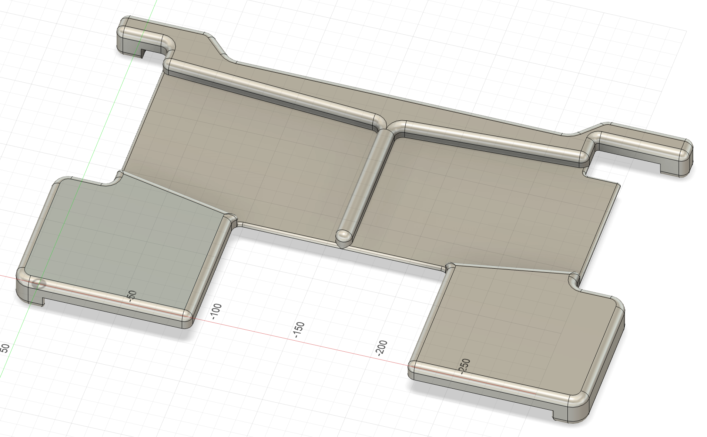

# MacBook Pro 14" — Any split keyboard

A plate shaped for the Apple MacBook Pro 14", compatible with most split ergonomic keyboards.

## Laptop compatibility

This plate is designed specifically for the **Apple MacBook Pro 14"**. It will not fit other laptop models.

Because the shape is tailored to that chassis, it offers several advantages:

- **No straps needed.** The plate clips around the laptop; ports remain accessible.
- **Screen protection.** When the lid closes, the frame rests on the plate before it reaches the screen.
- **Touch ID stays usable.** The Touch ID key is left uncovered.
- **Clean look.** The outline follows the lines of the MacBook chassis.

## Keyboard compatibility

The extruded section is intentionally oversized so that a wide range of split keyboards fit on top. You can simply place your keyboard on the plate and start typing.

**Tip:** before placing an order, print the `.stl` at 1:1 scale on paper and check that the outline matches your laptop and keyboard. It's the cheapest way to catch a sizing mistake.

Once you have found your preferred keyboard position and want to lock it in, you can adapt the plate in either of the following ways:

- **Drill holes** in the plate matching the location of the keyboard's rubber feet.
- **Add bumps** (for example, glued-on stops) inside the extruded section, around the keyboard's footprint, to prevent it from sliding.

## Specifications

- **Outer dimensions:** 345 × 220 mm
- **Thickness:** 22 mm
- **Recommended material:** Aluminium, CNC-machined
- **Approximate weight:** 600 g

## What's in this folder

- `plate.step` — recommended format for CNC machining services.
- `plate.stl` — for 3D printing (less recommended, see the [main README](../../../README.md)).
- `plate.f3d` — Fusion 360 source file. Open this to edit or remix the design.

## Notes

- The MacBook's built-in keyboard is covered except for the Touch ID key. The trackpad is still accessible.
- The lid can't be closed with the plate in place; But the plate acts as a spacer and protects the screen. The lid frame will touche the plate before the screen can.
- The MacBook Pro 14" speakers and side vents remain clear.
