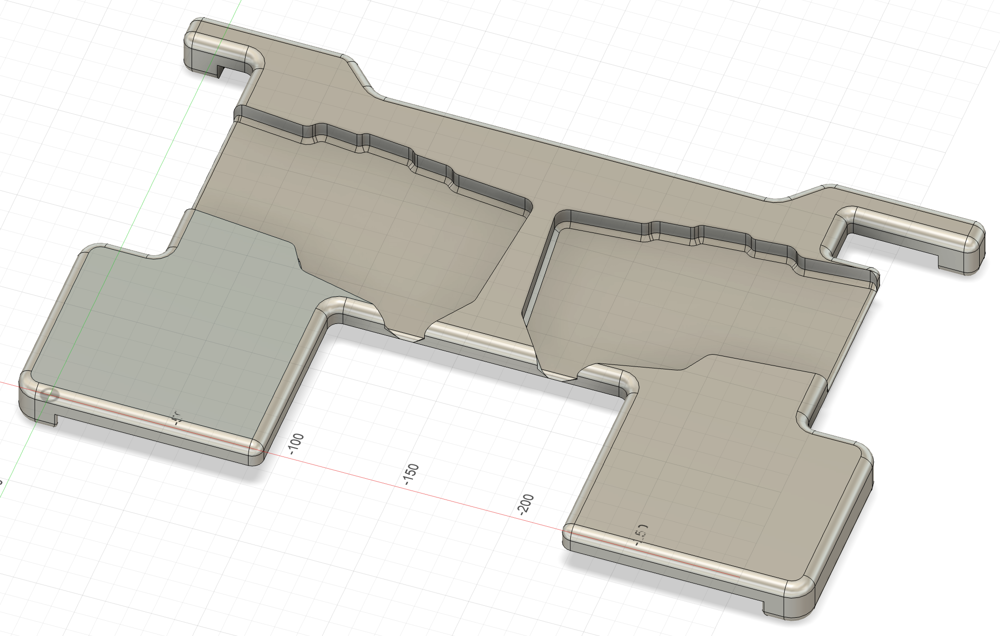

# MacBook Pro 14" — Typeractive Corne

A plate shaped for the Apple MacBook Pro 14" and tailored to the Typeractive Corne keyboard.

## Laptop compatibility

This plate is designed specifically for the **Apple MacBook Pro 14"**. It will not fit other laptop models.

Because the shape is tailored to that chassis, it offers several advantages:

- **No straps needed.** The plate clips around the laptop; ports remain accessible.
- **Screen protection.** When the lid closes, the frame rests on the plate before it reaches the screen.
- **Touch ID stays usable.** The Touch ID key is left uncovered.
- **Clean look.** The outline follows the lines of the MacBook chassis.

## Keyboard compatibility

This plate is made for the **Typeractive Corne, 6 columns, aluminium frame**. The extruded section matches the keyboard's outline exactly, so:

- the keyboard is held in place without any further adaptation;
- the overall look is sleeker than with the generic plate.

If you own a different keyboard, use the generic [`macbook_pro_14/any_keyboard`](../any_keyboard/) plate instead.

## Specifications

- **Outer dimensions:** 345 × 220 mm
- **Thickness:** 22 mm
- **Recommended material:** Aluminium, CNC-machined
- **Approximate weight:** 550 g

## What's in this folder

- `plate.step` — recommended format for CNC machining services.
- `plate.stl` — for 3D printing (less recommended, see the [main README](../../../README.md)).
- `plate.f3d` — Fusion 360 source file. Open this to edit or remix the design.

## Notes

- The MacBook's built-in keyboard is covered except for the Touch ID key. The trackpad is still accessible.
- The lid can't be closed with the plate in place; But the plate acts as a spacer and protects the screen. The lid frame will touche the plate before the screen can.
- The MacBook Pro 14" speakers and side vents remain clear.
